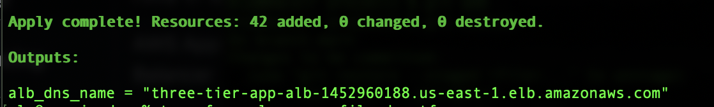
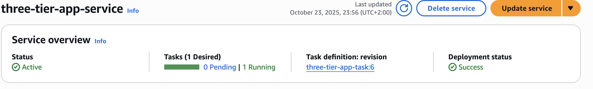
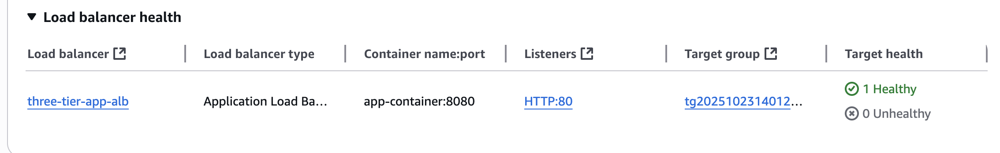
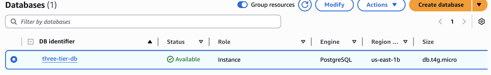
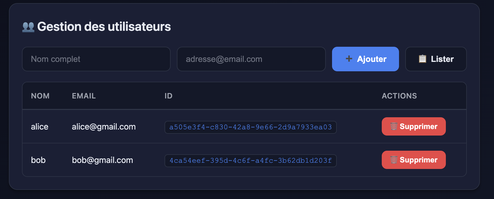
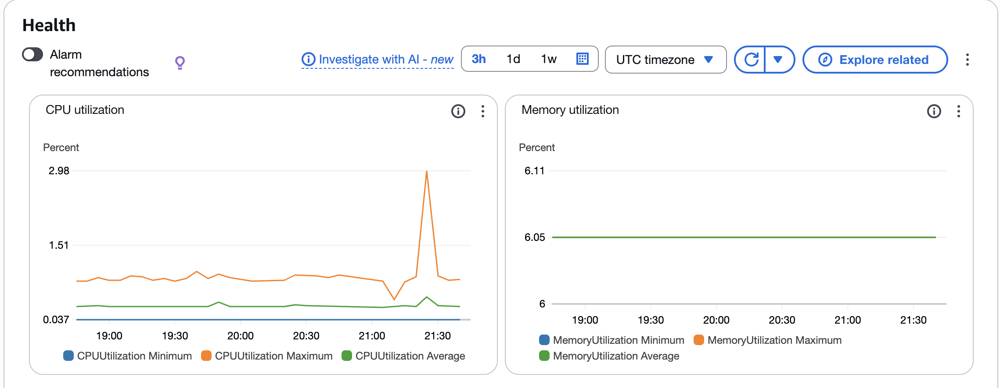

# 🏗️ Three-Tier Web Application on AWS

This project deploys a **three-tier web application** architecture on **AWS** using **Terraform**.  
It consists of a **frontend**, a **backend API (Flask)** running on **ECS Fargate**, and a **PostgreSQL database** hosted on **Amazon RDS**.  
An **Application Load Balancer (ALB)** routes incoming HTTP traffic to the backend running in private subnets.

---

##  Architecture Overview


## Components

| Layer | AWS Service | Description |
|-------|--------------|--------------|
| **Compute** |  ECS Fargate | Runs containerized application in serverless mode |
| **Networking** |  VPC, Subnets, IGW, Route Tables, NAT Gateway | Provides network isolation and internet access |
| **Load Balancing** |  Application Load Balancer (ALB) | Routes and balances incoming HTTP traffic |
| **Container Registry** |  ECR (Elastic Container Registry) | Stores Docker images for ECS tasks |
| **Monitoring** | CloudWatch Logs | Collects and centralizes logs from ECS tasks |
| **Identity & Access** |  IAM Roles & Policies | Grants ECS permissions to pull images and write logs |
| **Database** | RDS (PostgreSQL) | Stores persistent application data |
| **Secrets**  | AWS Secrets Manager | Stores database credentials securely |

---

## Terraform Modules
| Module | Description |
|-------|--------------|
| network/ | Creates VPC, public and private subnets, and route tables |
| security/ | Create security groups |
| ecs_service/ | Defines ECS cluster, task definitions, and services |
| alb/ | Creates Application Load Balancer, listener, and target group |
| rds/ | Deploys PostgreSQL instance |
| asm/ | Manages Secrets Manager entries for credentials |
| s3_website/ | Hosts optional static frontend (HTML/JS/CSS) |

## Application Flow

1) User accesses the ALB public DNS (HTTP).

2) ALB forwards requests to the ECS service target group.

3) ECS task (Flask API container) handles requests such as /api/users.

4) The API interacts with the PostgreSQL database via credentials stored in AWS Secrets Manager.

5) Health checks (/health) ensure container availability for load balancing.

---

##  Deployment Steps

1. Initialize and Deploy Terraform
   ```
    terraform init
    terraform plan
    terraform apply
   ```
2. Build and Push Docker Image
  ```
    docker build -t <image_name> .
    docker tag <image_name>:latest  <repos_url>/<image_name>:latest 
    docker push  <repos_url>/<image_name>:latest 
   ```
3.Access the Application
```
http://<alb-dns-name>/api/users
```


##  Technologies Used

| Category | Tool / Service | Purpose |
|-----------|----------------|----------|
| **Infrastructure** | Terraform | Infrastructure as Code (IaC) to provision AWS resources |
| **Compute** | AWS ECS Fargate | Run Docker containers without managing servers |
| **Networking** | AWS VPC + Subnets + SG | Secure, isolated network for workloads |
| **Load Balancing** | AWS Application Load Balancer | Routes HTTP traffic to ECS tasks |
| **Container Registry** | AWS ECR | Stores and versions Docker images |
| **Monitoring / Logging** | AWS CloudWatch | Tracks application logs and metrics |
| **Access Management** | AWS IAM | Manages permissions for ECS tasks and Terraform |
| **Secrets Management** | AWS Secrets Manager | Manages Secrets Manager on AWS like db password |
| **Containerization** | Docker | Packages the app for deployment on ECS |
| **Backend** | Flask (Python) | Flask is a lightweight WSGI web application framework  |
| **Version Control** | Git & GitHub | Source control and collaboration |


---

## 📸 Screenshots & Demo

Below are some screenshots showing the successful deployment and operation of the three-tier application on AWS.

### 🧱 Terraform Deployment
The entire infrastructure (VPC, ECS, ALB, RDS, etc.) is provisioned automatically with Terraform.


> ✅ Terraform apply completed successfully — all resources deployed via Infrastructure as Code.

---

### 🚀 ECS Cluster and Service
The Flask API container runs on **AWS ECS Fargate** in private subnets.


> ✅ ECS service is running with healthy tasks managed by Fargate.

---

### 🌐 Application Load Balancer (ALB)
The ALB routes incoming HTTP requests to the ECS tasks through a target group.


> ✅ Target group reports healthy ECS containers, confirming connectivity between the ALB and the backend.

---

### 🗄️ Amazon RDS Database
The application connects to an **RDS PostgreSQL** database for persistent data storage.


> ✅ RDS instance is available and connected to the Flask API via Secrets Manager credentials.

---

### 🧩 Application API (Flask)
The API exposes simple routes for listing and adding users.


> ✅ The endpoint `/api/users` returns data successfully through the ALB DNS.

---

### 💻 Optional Frontend (Static Web UI)
A minimal web interface (HTML/CSS/JS) allows users to add and list entries from the API.


> ✅ The frontend interacts directly with the backend API using the ALB public DNS.

---

### 📊 Monitoring & Logs
All ECS task logs are centralized in **CloudWatch Logs** for debugging and observability.


> ✅ Each API request is visible in real time from CloudWatch metrics and logs.

---


